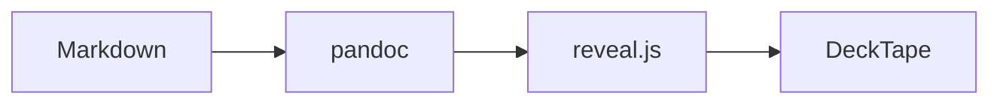

# Section One

Kicker text under the divider.

## Bullets {.compact}

- one
- two
  - nested `code`

::: incremental
- step a
- step b
:::

## Columns, math and notes

:::: columns
::: {.column width="50%"}
Left column with inline math $E = mc^2$ and a price of $5 (not math).
:::
::: {.column width="50%"}
Right column with an image:

{width=80}
:::
::::

$$\int_0^1 x^2\,dx = \tfrac13$$

::: notes
Speaker notes here.
:::

## Diagram



## Sequence

```{.mermaid width="70%"}
sequenceDiagram
  participant W as Workflow
  participant A as Action
  W->>A: build-html
  A-->>W: deck.html
```

# Section Two {background-color="#F47436"}

## Code, table, callout

```python
def hello(name: str) -> str:
    return f"hi {name}"
```

| a | b |
|---|---|
| 1 | 2 |

> [!NOTE]
> A callout converted from a GitHub alert.

Text before a pause.

. . .

Revealed later. See <https://example.com>.

---

A slide without a heading, forced by a horizontal rule.
